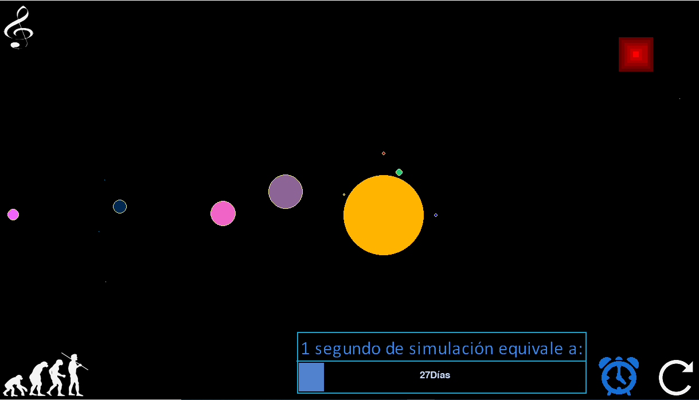
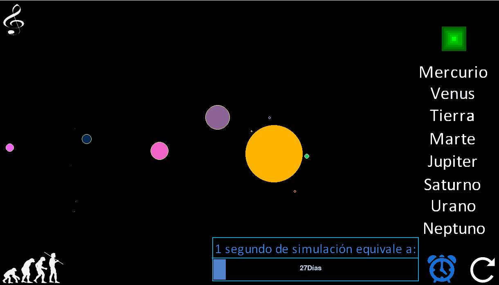
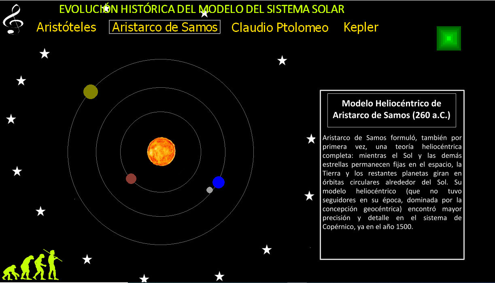

# Solar System

This project was developed in a very short time some years ago, so, maybe you can find that the code its not  very clean and optimized, soon im going to rewrite the code and add some ideas i would like to implement on it.

The project consist in a visual representacion of the solar system with some historicall models, the project idea is that can be usefull as a learning tool.

